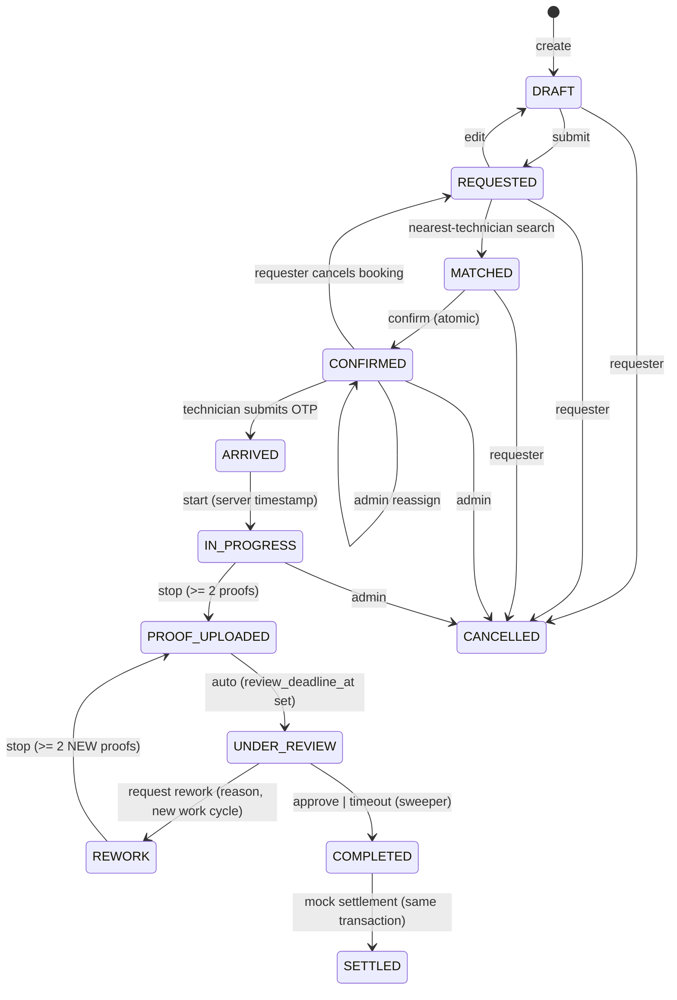
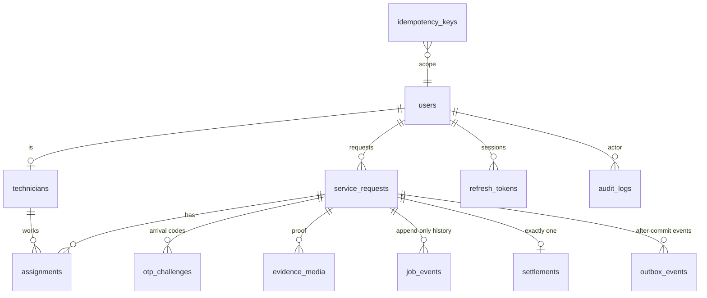

# Architecture

Field Asset Inspection & Repair Dispatch: a vertical slice of a real-time, location-aware, multi-role platform.
Requirements: [`docs/spec/SPEC.md`](spec/SPEC.md) (client spec) with the state-machine decision in [ADR 0006](adr/0006-spec-state-machine.md). Status: [`STATUS.md`](STATUS.md).

## Context

```mermaid
flowchart LR
  M[Mobile app<br/>React Native + Expo<br/>Requester + Technician] -- HTTPS JSON --> API
  A[Admin console<br/>Next.js + Tailwind] -- same-origin gateway --> API
  M <-. Socket.io .-> API
  A <-. Socket.io .-> API
  API[NestJS API<br/>REST + Socket.io] --> PG[(PostgreSQL + PostGIS<br/>system of record)]
  API --> R[(Redis<br/>throttling, presence, location cache,<br/>socket adapter)]
  API --> S[(S3-compatible storage<br/>MinIO, private bucket)]
```

- **PostgreSQL is the single source of truth** for every business fact. Redis holds only ephemeral data (rate-limit counters,
  technician presence/latest location, Socket.io fan-out) and is never the only copy of a transaction.
- Clients never decide role, state, price, time or timer. The API does, and clients render what it returns.

## Backend modules (`apps/api/src`)

| Module                | Responsibility                                                                                                         | Notes                                                                         |
| --------------------- | ---------------------------------------------------------------------------------------------------------------------- | ----------------------------------------------------------------------------- |
| `modules/auth`        | login, refresh rotation, `AccessGuard` (authenticate → role → throttle)                                                | argon2id, short-lived JWT, hashed rotating refresh tokens, default-deny roles |
| `modules/users`       | role-safe profile (`/users/me`)                                                                                        | never exposes hashes/status flags                                             |
| `modules/requests`    | create/edit/history/snapshot/reorder, `DispatchService` (PostGIS search, atomic confirm), `AccessService` (ownership)  | no socket code                                                                |
| `modules/jobs`        | `OtpService`, `JobsService` (start/stop/review/cancel/complete), `MediaService`, `SettlementService`, `SweeperService` | OTP/media/payment behind interfaces                                           |
| `modules/realtime`    | `RealtimeGateway` (JWT handshake, room auth), `OutboxPublisher`, Redis adapter                                         | never writes business data                                                    |
| `modules/technicians` | availability, location ingestion (Redis latest + throttled Postgres persist)                                           | `LocationProvider` is a mock interface                                        |
| `modules/admin`       | queries + privileged commands (reassign/cancel)                                                                        | goes through `TransitionService`; never bypasses rules                        |
| `infra/`              | `TransitionService`, `OutboxService`, `AuditService`, `IdempotencyService`, Prisma/Redis                               | shared, global module                                                         |
| `domain/`             | pure functions: pricing, ranking, OTP policy, media sniffing, exception flags, hashing                                 | 100 % unit-tested                                                             |

Layering: controller (DTOs only) → service (transaction + orchestration) → domain (pure rules) → SQL. The state machine itself is
a pure table in `packages/contracts` shared by API, admin and mobile.

## State machine (requirement spec §2)

Single table: [`packages/contracts/src/state-machine.ts`](../packages/contracts/src/state-machine.ts). Illegal transition → `409 ILLEGAL_TRANSITION`.
Every accepted transition writes a `job_events` row and an `audit_logs` row **in the same transaction**, and queues a `request.state.changed` outbox event.



Admin rows (`ADMIN_CANCEL` from any open state, `ADMIN_REASSIGN` from CONFIRMED/ARRIVED/IN_PROGRESS/REWORK back to CONFIRMED) are explicit table rows with a mandatory reason.

## Data model (ERD)



Migrations: [`infra/migrations`](../infra/migrations). Highlights: `geography(Point,4326)` + GiST indexes, `btree_gist`, check constraints on states, partial unique indexes, an exclusion constraint, append-only triggers.

## Concurrency strategy

| Invariant                                                  | Enforced by                                                                                                                          |
| ---------------------------------------------------------- | ------------------------------------------------------------------------------------------------------------------------------------ |
| One technician, one active job                             | row lock on the technician + partial unique index `assignments_active_technician_uq` + exclusion constraint `assignments_no_overlap` |
| One active assignment per request                          | partial unique index `assignments_active_request_uq` + request row lock                                                              |
| Two simultaneous confirms → one 200, one deterministic 409 | `SELECT … FOR UPDATE` on request then technician (fixed lock order); loser gets `STATE_CONFLICT` / `TECHNICIAN_UNAVAILABLE`          |
| Stale/duplicate commands never overwrite                   | `UPDATE … WHERE id AND version = $expected` after locking the row                                                                    |
| OTP consumed once                                          | row lock on the challenge + conditional `UPDATE … WHERE consumed_at IS NULL AND expires_at > now()`                                  |
| Failed OTP attempts are counted exactly                    | outcomes are _returned_ (not thrown) so the attempt counter commits; 12 parallel wrong guesses → exactly 5 invalid + lock            |
| Exactly one settlement                                     | created inside the completion transaction; `UNIQUE(request_id)` and `UNIQUE(idempotency_key)` as backstop                            |
| Retries are safe                                           | `Idempotency-Key` stored **in the same transaction** as the business change (ADR 0005)                                               |
| Events only after commit                                   | transactional outbox + publisher with `FOR UPDATE SKIP LOCKED` (ADR 0003)                                                            |
| Review timeout survives restarts / multiple instances      | persisted `review_deadline_at` + sweeper claiming rows with `SKIP LOCKED` (ADR 0004)                                                 |
| History cannot be rewritten                                | DB triggers reject UPDATE/DELETE/TRUNCATE on `job_events` and `audit_logs`                                                           |

## Security model

- AuthN: argon2id; 15-minute HS256 access JWT; opaque refresh token stored hashed, rotated on use, family revoked on reuse. Role/status are re-read from the database on every request (a forged or stale token cannot elevate).
- AuthZ: global `AccessGuard`, **default-deny** (a handler without `@Roles` is rejected). Ownership checks answer `404` for anything the caller may not see (no IDOR oracle). Socket rooms are authorized server-side; reassigned technicians are removed from live rooms.
- Input: zod schemas shared from `packages/contracts`, all `.strict()` (unknown fields rejected); parameterised SQL only; 100 kB body limit; helmet; CORS from env.
- OTP: `crypto.randomInt`, HMAC-SHA256 stored (never the code), TTL, attempt limit + lock, constant-time compare, uniform error text, never logged; the idempotency record uses a _keyed_ hash so it can't be used to brute-force codes.
- Media: server-generated keys, presigned PUT/GET with short TTL, size + SHA-256 + magic-byte verification before a file counts as evidence, ownership checked before signing.
- Logs: allow-list serializer (method, path, status) + redaction; test asserts passwords/OTPs/tokens never appear.
- Admin console: httpOnly + SameSite=Strict cookies, role verified server-side against the API, same-origin gateway allow-lists `admin/*`.

## Real-time design

- Rooms: `user:{id}`, `request:{id}`, `admin`. Events carry `{eventId, occurredAt, schemaVersion, seq, type, requestId, data}`.
- Clients treat events as _hints_ and refetch over REST; reconnect → refetch (`GET /requests/:id/snapshot?since=` returns the events missed after a cursor plus current state).
- Technician location samples go to Redis (latest + TTL) and are persisted to Postgres at most every `LOCATION_PERSIST_INTERVAL_SECONDS`; only authorized viewers receive `technician.location.updated`.
- Access tokens expire on live sockets: the server disconnects, the client reconnects with a fresh token.

## Assumptions

1. `CANCELLED` is an added terminal state: the spec's diagram has no terminal for requester cancellation before a booking or for admin cancellation.
2. `POST /requests` creates a `DRAFT` and submits it in the same transaction (two events); `PATCH /requests/:id` is `REQUESTED → DRAFT → REQUESTED`.
3. Confirm requires `MATCHED`, i.e. the nearby search happened first (search is a transition, `REQUESTED → MATCHED`).
4. `stop` records `PROOF_UPLOADED` and `UNDER_REVIEW` (two events) in one transaction; `COMPLETED → SETTLED` likewise.
5. A rework opens a new **work cycle** (proofs are counted per cycle; earlier proofs and review events are kept).
6. Money is integer minor units (INR paise); quote = fixed category base + per-km travel, computed only on the server.
7. Technician "freshness": only technicians seen within `LOCATION_FRESHNESS_SECONDS` are matchable (dev default is long so the seeded demo stays fresh).
8. Ratings are static seed values; there is no rating flow in the trial.
9. Evidence count cap: 10 items per work cycle.

## Path to the 25-day product

- Replace mocks behind existing interfaces: `PaymentProvider` (real gateway + payouts), `StorageProvider` (S3/MinIO already implemented, untested here), `LocationProvider` (device GPS + background tracking).
- Add KYC/identity as a separate service with its own store; keep operational profiles free of identity data.
- Observability: ship the structured logs + correlation ids to a log store, add metrics/alerts; move the sweeper/outbox to dedicated workers if load requires (they are already multi-instance safe).
- Scale-out: API is stateless apart from Redis-backed sockets; add a read replica for admin queries; partition `audit_logs`/`job_events` by time.
- Geo: surge/area matching, ETA from a routing service, geofenced arrival.
- Product: scheduling windows with capacity, cancellations/fees, ratings, push notifications, multi-tenant admin roles.

ADRs: [`docs/adr`](adr).
